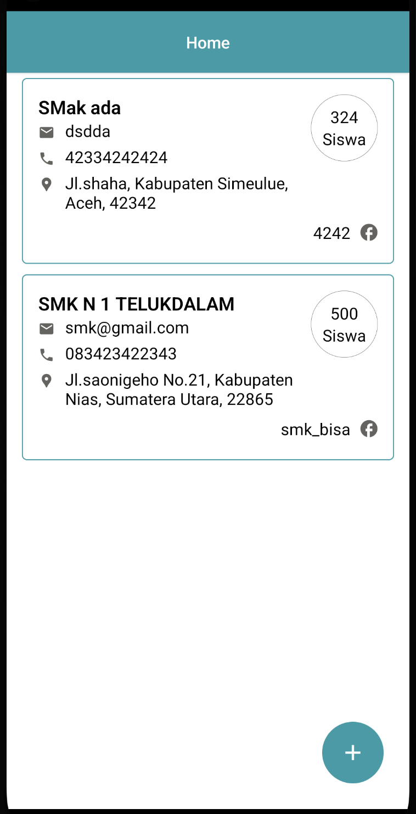
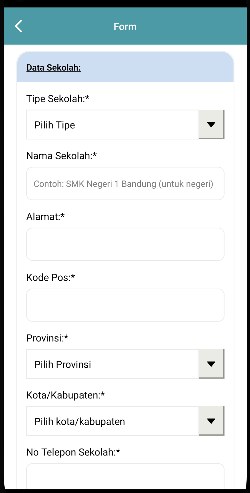
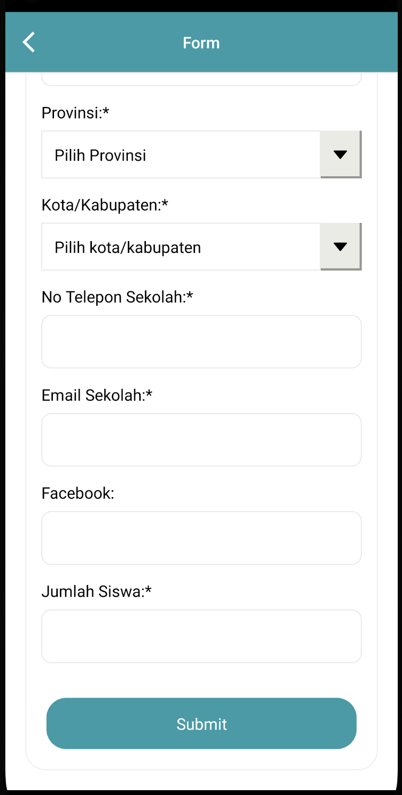

# Form Pendaftaran

#### Wellcome to Form Pendaftaran App.

##### [RELEASE DOWNLOAD](https://github.com/mardibll/form-pendaftaran/releases)

## Features

```sh
- List
- Form
- Responsive
```

## SCREENSHOT

---

<div style="background-color: #DEFFE1; padding: 20px;">
    
    
    
</div>

---

## Get Started

#### 1. Installation IOS AND ANDROID

On the command prompt run the following commands

```sh
$ git clone https://github.com/mardibll/form-pendaftaran.git

$ cd TestMobile

$ npm i && cd ios && pod install && cd ..
```

#### 2. Simulate for iOS

```sh
$ npm run ios
```

#### 3. Simulate for Android

```sh
$ npm run android
```

#### 4. Clean Android

```sh
$ cd android && ./gradlew clean && ./gradlew --stop && cd ..
```

#### 5. Release Android

```sh
$ cd android && ./gradlew clean && ./gradlew assemblerelease && cd ..
```
